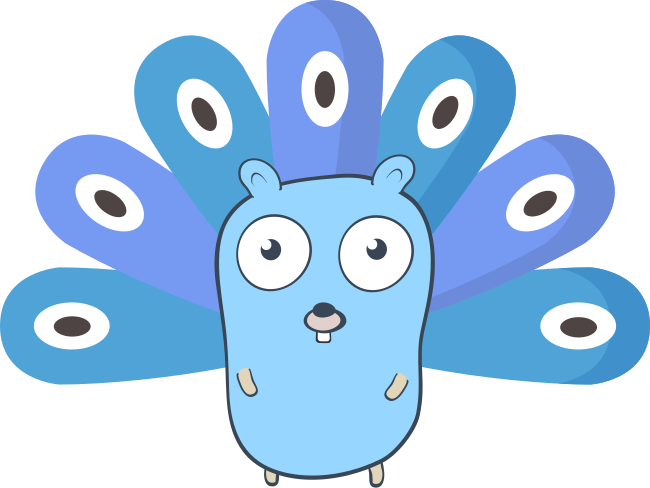

# ArgosMiner



ArgosMiner is a process mining system. It collects events from various sources and traces the underlying discovered process models over time. 

The following features distinguish ArgosMiner from other process mining systems:
- foo
- bar

## ToDos
- Finish API Endpoints (1 day)
- Embedd User Interface in Single Binary (have a look at Prometheus) (0,5 days)
- Implement a Partitioning Layer above BadgerDB (1 day)
- Random Event Emitter Source (Regular Intervals, e.g. every second) (2 hours)
- Turn Raw Events Logstore on and off 

- https://github.com/tidwall/wal

## Requirements of TSDB for First Version
- Sum of Events per EventType per Day (<-- Partition by Day) 
    - We need to go through all days and count...
- Sum of Events per Day (<-- Partition by Day)
    - We need to get the overall counter per day
- Sum of Events per directly-follows relation for certain time-window and certain event types (<-- this is our DFG)
    - 

- Meta KV-Store {Key=[#0General;#1EventType;#2DFRelation]; Value=Counter}
    - Count of distinct event types for entire period (Count with Prefix Search)
    - Count of Events for Certain Event Types for entire period (Simple Get)
    - Count of all events for entire collection period (Get of Counter Variable)
    - Count of distinct directly-follows relations for entire period (Count with Prefix Serach)
    - Sum of Events per directly-follows relation for entire period (Simple Get of a single DF)
    - Count of directly-follows relations for entire period (Sum of all DF values by Prefix Search)

- EventLog KV-Store {Key=ULID; Value=Serialized Event} 
    - Log of all received events

## Architecture Overview
tbd.
- Using tidwall/gjson accessing multiple fields witihn the JSON string
- Badger as an embedded key-value store building on LSM trees

### Performance Improvements
- Kafka: Using asynchronous commits (e.g., every second) resulted in a performance of more than 100.000 messages/second (Kafka Source + Raw Parser + Null Receiver), which is more than sufficient for our purposes. Drawback: After a failure, we might ingest duplicate events.
- JSON Parser: From 15.000 messages/second to around 80.000 messages/second

## Install
There are various ways of installing ArgosMiner.

### Precompiled Binaries
Precompiled binaries for released versions are available in the download section.

### Docker Images
Docker images are available on Docker Hub.

### Building from Source
tbd.

## For Later
- Embedded Graph-DB: https://github.com/krotik/eliasdb
- Have a look on this DB (maybe for own event db implementation): https://github.com/kelindar/talaria
- Have a look on this https://barkeywolf.consulting/posts/badger-event-store/

## ULID
We use ULID as the identifier for events. ULIDs are timestamp-aware and, thus, lexicographically sortable. This enables us to efficiently search for events applying a prefix search of the underlying LSM tree. 

Spec for ULID: https://github.com/ulid/spec

The timestamp is accurate to the millisecond.
```
 01AN4Z07BY      79KA1307SR9X4MV3
|----------|    |----------------|
 Timestamp           Entropy
  10 chars           16 chars
   48bits             80bits
   base32             base32
```

- 1.21e+24 unique ULIDs per millisecond (1,208,925,819,614,629,174,706,176 to be exact)
- UNIX-time in milliseconds
- Won't run out of space till the year 10889 AD
